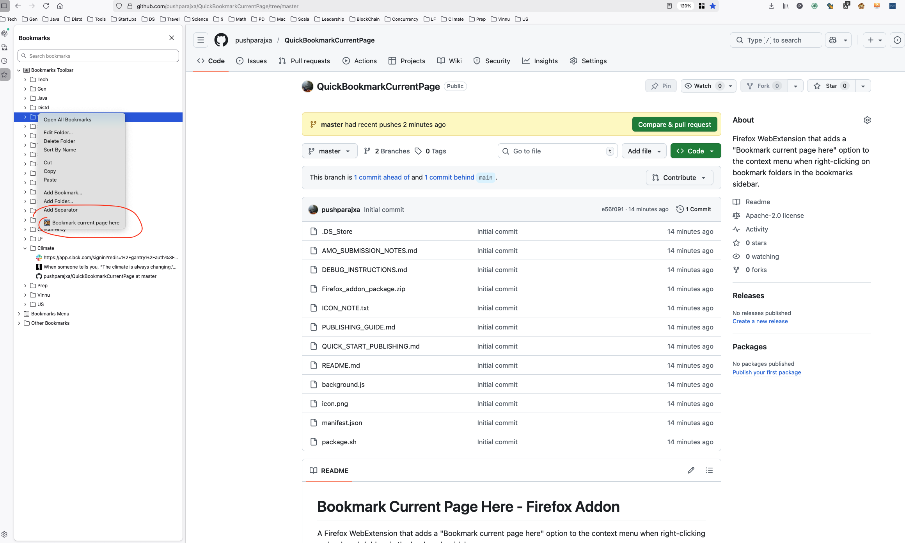

# Bookmark Current Page Here - Firefox Addon

A Firefox WebExtension that adds a "Bookmark current page here" option to the context menu when right-clicking on bookmark folders in the bookmarks sidebar.

## Features

- Adds a context menu option when right-clicking on bookmark folders
- Quickly bookmark the current page into the selected folder
- Works with the bookmarks sidebar (Cmd+B / Ctrl+B)

## Installation

### Temporary Installation (for testing)

1. Open Firefox
2. Navigate to `about:debugging`
3. Click "This Firefox" in the left sidebar
4. Click "Load Temporary Add-on..."
5. Select the `manifest.json` file from this directory

### Permanent Installation

1. Package the extension:
   - Create a ZIP file containing all files (manifest.json, background.js, icon.png)
   - Rename the ZIP file to have a `.xpi` extension
2. In Firefox, go to `about:addons`
3. Click the gear icon and select "Install Add-on From File..."
4. Select your `.xpi` file

## Usage

1. Press `Cmd+B` (Mac) or `Ctrl+B` (Windows/Linux) to open the bookmarks sidebar
2. Right-click on any bookmark folder
3. Select "Bookmark current page here" from the context menu
4. The current page will be bookmarked in the selected folder

## Files

- `manifest.json` - Extension manifest with permissions and configuration
- `background.js` - Background script that handles context menu creation and bookmark functionality
- `icon.png` - Extension icon (48x48 and 96x96 pixels)

## Permissions

This extension requires the following permissions:
- `bookmarks` - To create bookmarks in folders
- `tabs` - To get the current active tab information
- `menus` - To add context menu items
- `activeTab` - To access the current tab's URL and title

## Development

To modify the extension:
1. Edit the files as needed
2. Reload the extension in `about:debugging` (click the reload button)
3. Test your changes

## Notes

- The context menu option only appears when right-clicking on bookmark folders (not individual bookmarks)
- The extension will not bookmark pages with `about:` or `moz-extension:` URLs
- If the current tab doesn't have a valid URL, the bookmark operation will fail silently

